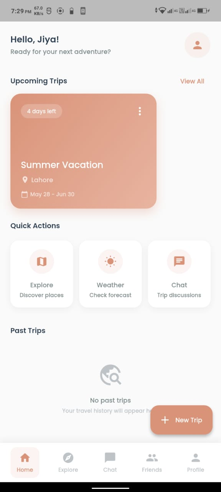
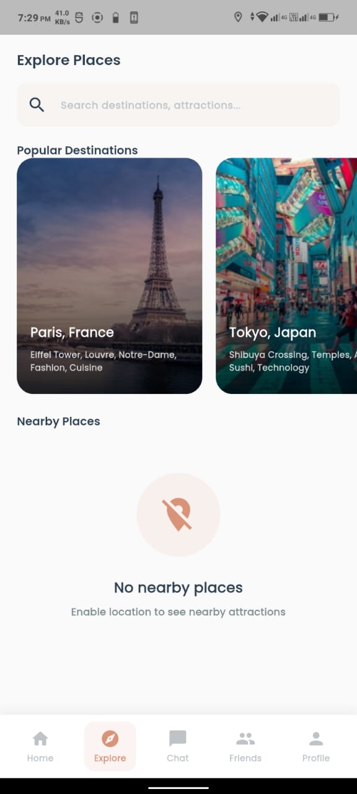
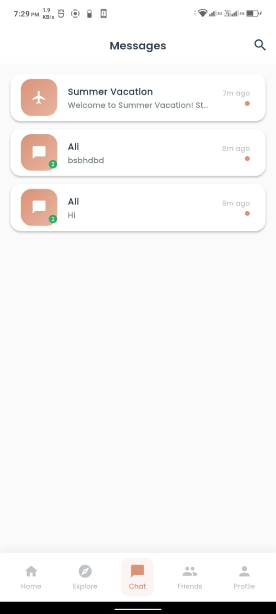
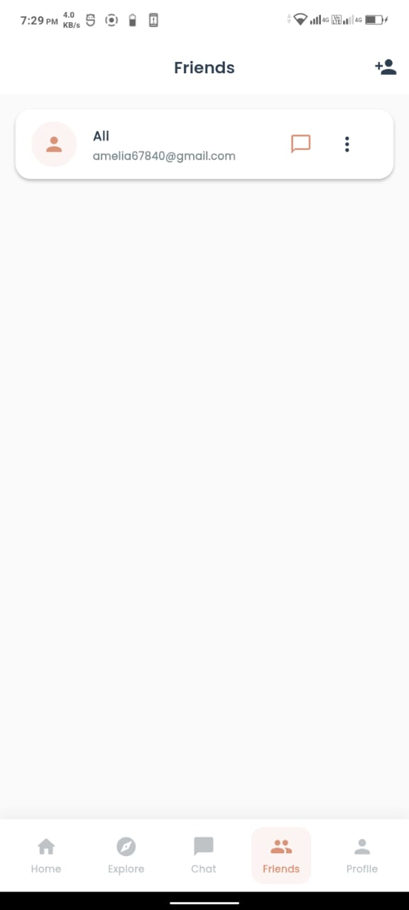
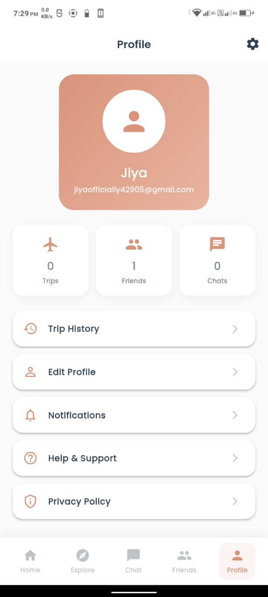

## 🌍 Genz Go
A premium Flutter travel planner app built for the modern generation. Plan trips, explore destinations, connect with friends, and create unforgettable memories — all in one beautiful app.
 ## Flutter 
 ## Firebase 
 ## Dart 

## ✨ Features
# 🗺️ Trip Planning
- Create and manage trips with destinations, dates, and activities
- Smart activity scheduling with time and location
- Edit and delete activities on the go
- Reuse past trips as templates for new adventures
# 👥 Social & Friends
- Add friends and manage friend requests
- Real-time private chat with friends
- Group chat auto-created when you plan a trip together
- Vote on trip proposals within group chats
# 🔍 Explore & Discover
- Search destinations and attractions powered by Foursquare API
- Nearby places discovery with distance calculation
- Interactive maps with flutter_map
- Weather check for any destination
- AI-powered travel advice via OpenRouter
# 💬 Real-time Chat
- One-on-one private messaging
- Group chat with trip proposals
- Voting system for trip proposals (Yes/No)
- Auto trip creation when proposal is accepted
- Message bubbles with timestamps
# 🎨 Premium UI
- Beautiful #D99379 terracotta premium color theme
- Dark purplish accent palette
- Smooth animations and transitions
- Responsive design for all screen sizes
- Custom cards, buttons, and loading indicators

# 📁 Project Structure
```
lib/
├── core/
│   ├── constants/
│   │   ├── app_colors.dart          # App color palette
│   │   └── api_keys.dart            # API keys (not in repo)
│   ├── models/
│   │   ├── place_model.dart         # Place/destination data
│   │   ├── trip_model.dart          # Trip data
│   │   ├── message_model.dart       # Chat message data
│   │   ├── activity_model.dart      # Trip activity data
│   │   └── user_model.dart          # User profile data
│   ├── providers/
│   │   ├── auth_provider.dart       # Authentication state
│   │   ├── chat_provider.dart       # Chat messages state
│   │   ├── explore_provider.dart  # Explore/places state
│   │   ├── trip_provider.dart       # Trips state
│   │   └── location_provider.dart  # GPS location state
│   └── services/
│       ├── location_service.dart    # GPS & distance calculation
│       ├── notification_service.dart # Toast notifications
│       └── friend_service.dart      # Friend requests logic
├── screens/
│   ├── auth/
│   │   └── auth_screen.dart         # Login/Register
│   ├── home/
│   │   └── home_screen.dart         # Dashboard
│   ├── chat/
│   │   ├── chat_screen.dart         # Chat interface
│   │   └── chat_list_screen.dart    # Conversations list
│   ├── explore/
│   │   ├── explore_screen.dart      # Explore destinations
│   │   └── place_detail_screen.dart # Place details view
│   ├── trips/
│   │   ├── create_trip_screen.dart  # Create new trip
│   │   ├── trip_detail_screen.dart  # Trip details & activities
│   │   └── trip_history_screen.dart # Past trips
│   ├── friends/
│   │   └── friends_screen.dart      # Friends management
│   └── profile/
│       └── profile_screen.dart      # User profile & logout
├── widgets/
│   ├── common/
│   │   ├── custom_button.dart
│   │   ├── loading_indicator.dart
│   │   └── empty_state.dart
│   ├── chat/
│   │   ├── message_bubble.dart
│   │   └── vote_buttons.dart
│   └── explore/
│       └── place_card.dart
└── main.dart

```

 
  
  
  
  